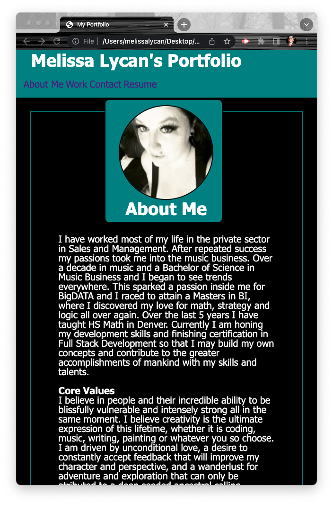
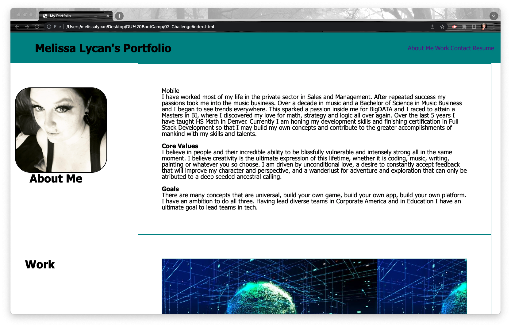
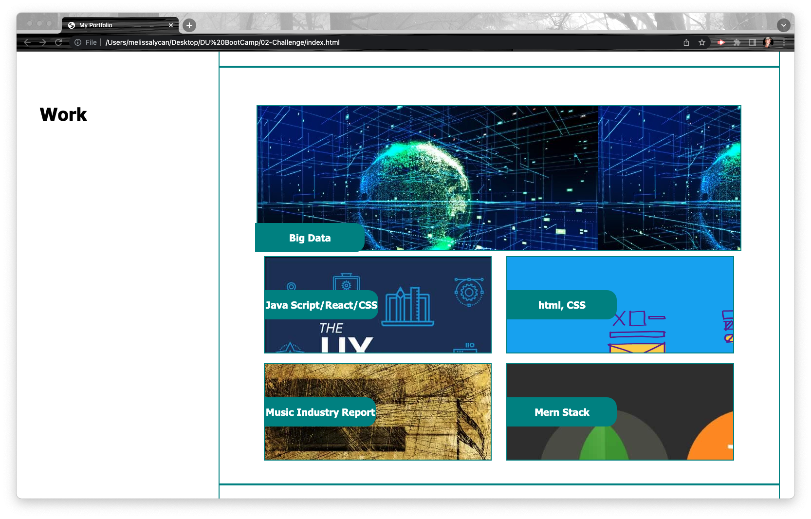

//Advance Css Portfolio//

# Challenge-02

This is the README.md file for Challenge 2 in Advanced CSS

Live 

During this challenge I was tasked with building from scratch all of the semantic code and css to build my own portfolio.

I used semantic html tags to build the page.  
I used flexbox to align groups of items.
I used anchor tags to moved to different parts of the page.  
I linked to my Linked in Portfolio for my Resume.  
I added a portfolio headshot
I added pictures to each card in the work area
I used media tags to change the appearance of the mobile site
I was able to add a font family
I was able to style using nested classes and id's

